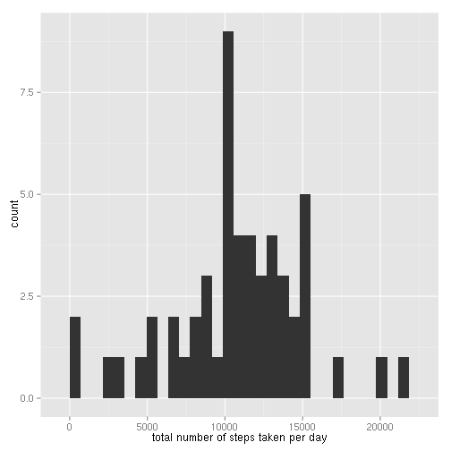
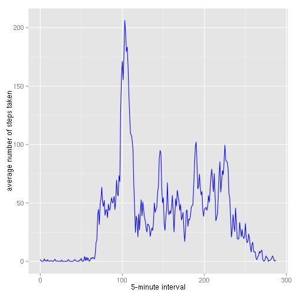
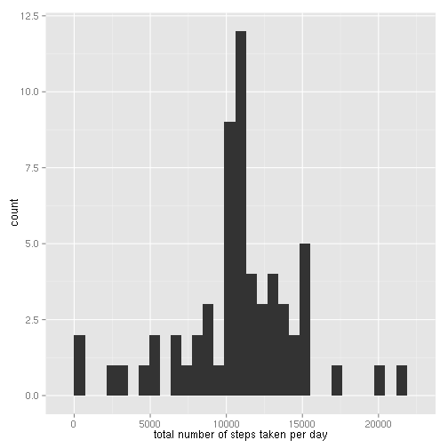
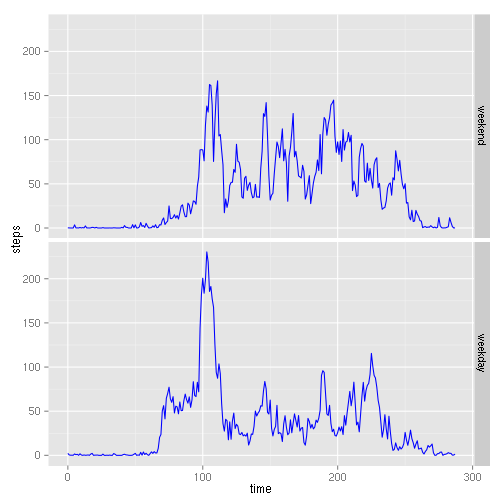

## Loading and preprocessing the data


```r
df <- read.csv("activity.csv")

# convert factor to date format
df$date <- as.Date(as.character(df$date))
```

## What is mean total number of steps taken per day?


```r
# split data frame by date
days <- split(df, df$date)

# the function caculates sum of the step in a day
f <- function(x){
    stps <- x$steps[!is.na(x$steps)]
    if(length(stps) == 0)
        NA
    else
        sum(stps)
}

stepsPerDay <- sapply(days, f)

# remove NA
stepsPerDay <- stepsPerDay[!is.na(stepsPerDay)]

library(ggplot2)
qplot(stepsPerDay, xlab="total number of steps taken per day")
```

 

mean of total number of steps taken per day is:

```r
mean(stepsPerDay)
```

```
## [1] 10766.19
```
median of total number of steps taken per day is:

```r
median(stepsPerDay)
```

```
## [1] 10765
```

## What is the average daily activity pattern?

```r
# split data frame by interval
itvs <- split(df, df$interval)

# caculate mean steps for each interval
avgStep <- sapply(itvs, function(x){mean(x$steps, na.rm=TRUE)})

# preparing data frame for plotting
times <- 0:(24*12-1)
avgStepDf <- as.data.frame(cbind(times, avgStep))
colnames(avgStepDf) <- c("time", "steps")

ggplot(avgStepDf, aes(time, steps)) + 
geom_line(colour="blue") +
xlab("5-minute interval") + 
ylab("average number of steps taken")
```

 

the interval that contains maximum number of step is:

```r
# find maximum element, and get its name(time)
names(which(avgStep == max(avgStep)))
```

```
## [1] "835"
```

## Imputing missing values

total number of missing values in the dataset is:

```r
length(df[is.na(df)])
```

```
## [1] 2304
```

filling in missing values in the dataset: 

```r
# a function that caculate the step average in a day
# and fill the average into NA
f <- function(x){
    avg <- mean(x$steps, na.rm=TRUE)
    if(is.na(avg)) # all value is missing in this day
        avg = 0
    i <- 1
    for(ina in is.na(x$steps)){
        if(ina)
            x$steps[i] <- avgStep[i]
        i <- i+1
    }
    x
}
days <- lapply(days, f)

stepsPerDay <- sapply(days, function(x){sum(x$steps)})

qplot(stepsPerDay, xlab="total number of steps taken per day")
```

 

mean with na value filled in:

```r
mean(stepsPerDay)
```

```
## [1] 10766.19
```
median with na value filled in:

```r
median(stepsPerDay)
```

```
## [1] 10766.19
```

we can see the median is closer to mean after we fill NA with the average step in the interval.

## Are there differences in activity patterns between weekdays and weekends?


```r
# a function that convert day string to weekend/weekdays factor
wk2fac <- function(inp){
    x <- weekdays(as.Date(inp), abbreviate=T)
    if(x == "Sat" || x == "Sun")
      as.factor("weekend")
    else
      as.factor("weekdays")
}

wkds <- sapply(names(days), wk2fac)
daysByType <- split(days, wkds)

# get data for weekday and weekends
weekday <- Reduce(function(...){merge(..., all=T)}, daysByType[[1]])
weekend <- Reduce(function(...){merge(..., all=T)}, daysByType[[2]])

avgStepWeekday <- sapply(split(weekday, weekday$interval), function(x){mean(x$steps)})
avgStepWeekend <- sapply(split(weekend, weekend$interval), function(x){mean(x$steps)})

# preparing data frame for plotting
times <- 0:(24*12-1)
avgStepWeekday <- as.data.frame(cbind(times, avgStepWeekday))
avgStepWeekend <- as.data.frame(cbind(times, avgStepWeekend))
colnames(avgStepWeekend) <- c("time", "steps")
colnames(avgStepWeekday) <- c("time", "steps")

avgStepWeekend$type <- as.factor("weekend")
avgStepWeekday$type <- as.factor("weekday")

# merge the result, prepare for plotting
data <- merge(avgStepWeekend, avgStepWeekday, all=T)

ggplot(data, aes(time, steps)) + geom_line(colour="blue") + facet_grid(type ~ .)
```

 
